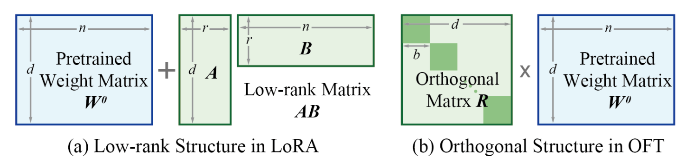
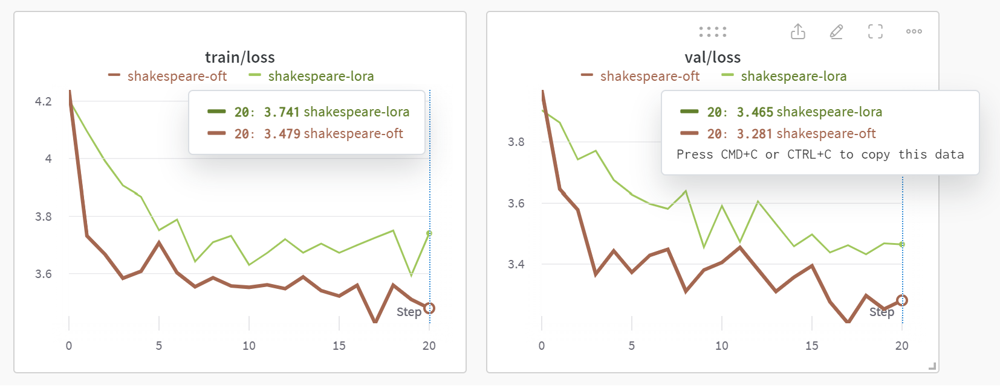
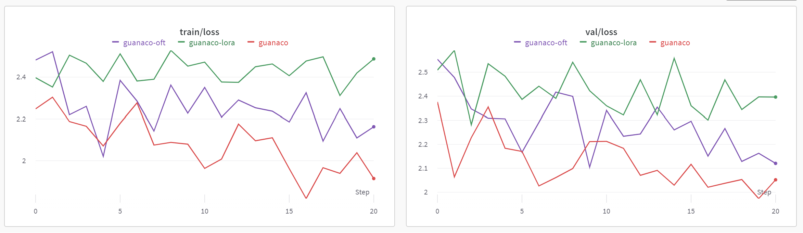

## MinOFT
An extension of [karpathy/nanoGPT](https://github.com/karpathy/nanoGPT) which includes orthogonal fine-tuning (OFT), introduced in the paper [Controlling Text-to-Image Diffusion by Orthogonal Finetuning](https://arxiv.org/abs/2306.07280). LoRA updates the pretrained weight
matrix by adding a product of two low-rank matrices. OFT learns an orthogonal matrix to transform the neurons of the
same layer, and it achieves stronger generalization and consistently more stable training than LoRA.


<br/><br/>

### Main Additions
These are the main files that build upon [karpathy/nanoGPT](https://github.com/karpathy/nanoGPT) and [cccntu/minLoRA](https://github.com/cccntu/minLoRA/tree/main).
- `finetuning/modular_oft.py` is the OFT implementation simplified to ~500 lines of code.
- `train_nanogpt.py` is an extension of the original `train.py` script from [karpathy/nanoGPT](https://github.com/karpathy/nanoGPT) but now the config files have additional flags for `use_mlora`, `use_moft` (modular LoRA and OFT) as well as `use_plora` (parametrized LoRA, from [cccntu/minLoRA](https://github.com/cccntu/minLoRA/tree/main)).
- `train_huggingface.py` is a demo script for fine-tuning a [roberta-base](https://huggingface.co/roberta-base) model on the [eli5](https://huggingface.co/datasets/eli5) dataset.
- `push_to_hub.py` allows you to push your fine-tuned GPT2 models to the huggingface hub with the same config file used for training.
<br/><br/>

### Training on Tiny Shakespeare
To prepare the [tiny-shakespeare](https://raw.githubusercontent.com/karpathy/char-rnn/master/data/tinyshakespeare/input.txt) text dataset for GPT2 and start training, run the following commands:
```
python data/shakespeare/prepare.py
python train_nanogpt.py config/finetune_shakespeare.py
```

To push your model to Hugging Face Hub after training, run the following command:
```
python push_to_hub.py config/finetune_shakespeare.py
```

Below is a sample training run on tiny shakespeare (100 iterations) comparing regular LoRA and OFT.

<br/><br/>

### Training on Guanaco
To prepare the [openassistant-guanaco](https://huggingface.co/datasets/timdettmers/openassistant-guanaco) instruction tuning dataset for GPT2 and start training, run the following commands:
```
python data/guanaco/prepare.py
python train_nanogpt.py config/finetune_guanaco.py
```

To push your model to Hugging Face Hub after training, run the following command:
```
python push_to_hub.py config/finetune_guanaco.py
```

Below is a sample training run on guanaco (100 iterations) comparing regular fine-tuning, LoRA, and OFT.


<br/><br/>


### General Usage 

You can install minOFT using the commands below:

```
git clone https://github.com/alif-munim/minOFT.git
cd minOFT/
pip install -e .
```

Then, you can inject OFT into any PyTorch model with linear layers.

```python
from minoft.modular_oft import inject_trainable_oft
import torch

# Load model and tokenizer, then freeze model weights
# ...
model.requires_grad_(False)

# Set OFT parameters
oft_r=4
oft_eps=1e-3
oft_coft=False
oft_block_share=False
normalize=False
search_class=[nn.Linear] # Default is only nn.Linear, but you can also pass nn.Conv2d

# Set training and optimization parameters
learning_rate=2e-5
weight_decay=0.01
beta1 = 0.9
beta2 = 0.95

# Replace modules with trainable OFT linear modules
ft_modules = ["CausalSelfAttention"] # Modules will be specific to your model, but you can target any number of them
oft_params, train_names = inject_trainable_oft(model, target_replace_module=ft_modules, 
                                              verbose=False, r=oft_r, eps=oft_eps, is_coft=oft_coft, block_share=oft_block_share,
                                              normalize=normalize, search_class=search_class)
# Set optimizer
optim_groups = [
    {
        "params": oft_params,
        "weight_decay": weight_decay
    }
]
optimizer = torch.optim.AdamW(optim_groups, lr=learning_rate, betas=(beta1, beta2))

# Train as usual
# ...
```

You can also try fine-tuning a [roberta-base](https://huggingface.co/roberta-base) model on the [eli5](https://huggingface.co/datasets/eli5) dataset using the `train_huggingface.py` script. Just make sure that whatever causal language model you're using actually has linear layers (GPT2 style models use Conv1D instead of Linear). If you're not sure, you can set `debug = True` in the training script to check the modules.

```
python train_huggingface.py
```
<br/><br/>

### Evaluations
For downstream evaluation, I would highly recommend using [EleutherAI/lm-evaluation-harness](https://github.com/EleutherAI/lm-evaluation-harness/tree/master). The repository is compatible with huggingface models, and after installing you can run evals as follows:

```
python lm-evaluation-harness/main.py --model hf-causal --model_args pretrained=alif-munim/gpt2-small-guanaco,tokenizer=gpt2 --tasks hellaswag --device cuda:0 --limit 0.05 --num_fewshot 0
```
<br/><br/>

### Special Thanks
- This project is an extension of the [karpathy/nanoGPT](https://github.com/karpathy/nanoGPT) repository created by Andrej Karpathy.
- It is also heavily inspired by [cccntu/minLoRA](https://github.com/cccntu/minLoRA/tree/main), although the much of the actual LoRA and OFT implementations are borrowed from [cloneofsimo/lora](https://github.com/cloneofsimo/lora) and [Zeju1997/oft](https://github.com/Zeju1997/oft) respectively.
    - The original minLoRA implementation has been moved to `finetuning.parametrized_lora` and can be set using `use_plora` in your config file. The modular versions of LoRA and OFT can be set using the `use_mlora` and `use_moft` flags.
<br/><br/>


### To-Do
- [ ] Implement butterfly-factorized OFT
- [x] Add functionality to upload fine-tuned GPT2 models to huggingface hub
- [x] Include examples for LM evals
- [x] Merge and unload LoRA, OFT modules
- [x] Clean up and customize configs
- [ ] Remove redundant implementations
- [ ] Test OFT implementation for Conv1D, Conv2D, Embedding layers
- [x] Include usage demo in README.md
- [x] Include huggingface training example
- [x] Clean up and simplify implementation